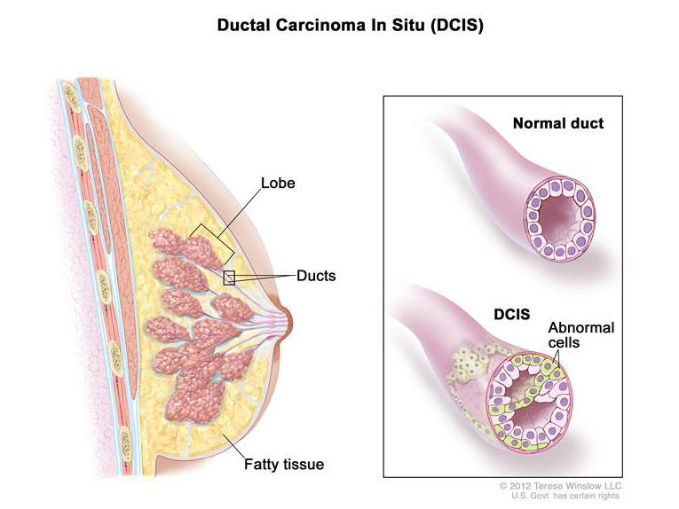

### Team Name: 

*qt*

### Project Description: 

<h3> Quantum-Aided Medical Image Diagnosis </h3>

  

#### Objective
Inasive ductal carcinoma (IDC) is - with ~ 80 % of cases - one of the most common types of breast cancer. It's malicious and able to form metastases which makes it especially dangerous. Often a biopsy is done to remove small tissue samples. Then a pathologist has to decide whether a patient has IDC, another type of breast cancer or is healthy. In addition sick cells need to be located to find out how advanced the disease is and which grade should be assigned. This has to be done manually and is a time consuming process. Furthermore the decision depends on the expertise of the pathologist and his or her equipment. Here, I'm proposing to use <b> Quantum Genetic Algorithm (QGA) </b> and <b> Support Vector Machines (SVMs)</b>. I hope this method will be having effective results when compared to some of the standard approaches.

### Dataset:

#### Context
Invasive Ductal Carcinoma (IDC) is the most common subtype of all breast cancers. To assign an aggressiveness grade to a whole mount sample, pathologists typically focus on the regions which contain the IDC. As a result, one of the common pre-processing steps for automatic aggressiveness grading is to delineate the exact regions of IDC inside of a whole mount slide.

#### Content
The original dataset consisted of 162 whole mount slide images of Breast Cancer (BCa) specimens scanned at 40x. From that, 277,524 patches of size 50 x 50 were extracted (198,738 IDC negative and 78,786 IDC positive). Each patch’s file name is of the format: uxXyYclassC.png — > example 10253idx5x1351y1101class0.png . Where u is the patient ID (10253idx5), X is the x-coordinate of where this patch was cropped from, Y is the y-coordinate of where this patch was cropped from, and C indicates the class where 0 is non-IDC and 1 is IDC.

### Source code: 

*[Code](https://github.com/shadab-entrepreneur/QuantumComputing/edit/main/QHack-2021/Open%20Hack/)*

### References:
- https://www.researchgate.net/publication/342391570_Quantum_neural_network_for_quicker_clinical_prognostic_analysis_An_application_and_experimental_study_using_CT_scan_images_of_COVID-19_patients
- https://deepai.org/publication/quantum-medical-imaging-algorithms
- https://link.springer.com/article/10.1007/s00521-020-05518-x
- https://arxiv.org/abs/2011.02831

### Resource Estimate: 

*A 1-2 paragraph written Resource Estimate, indicating how you expect to use the additional AWS credits, if awarded, to finish your Open Hackathon project.*
